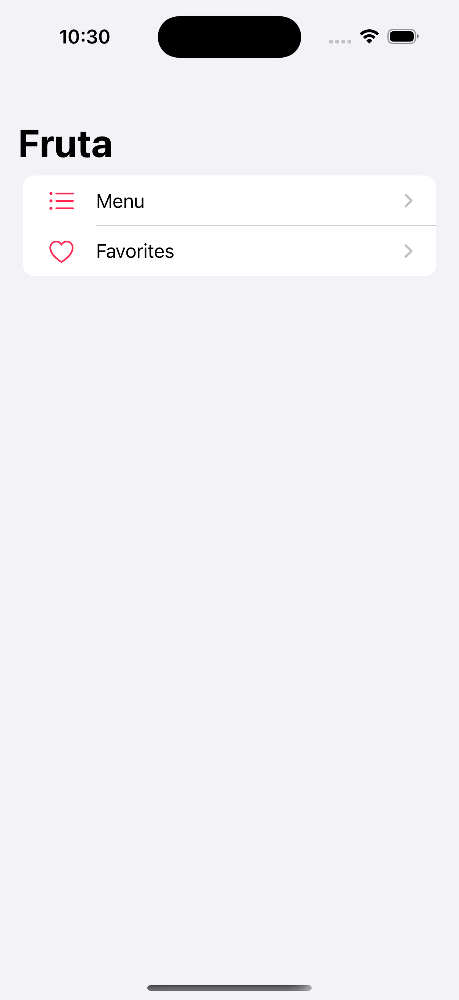
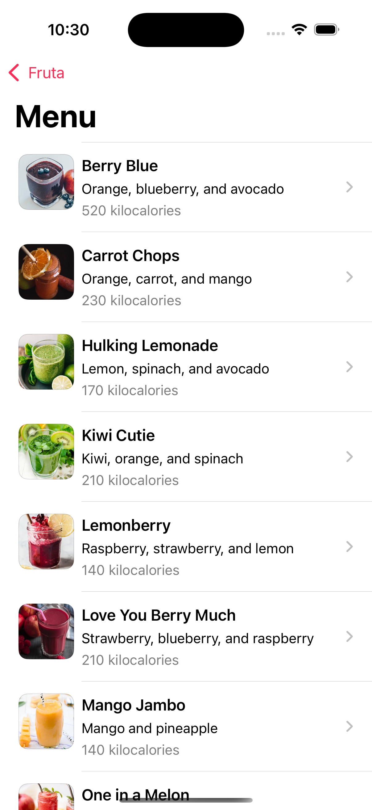
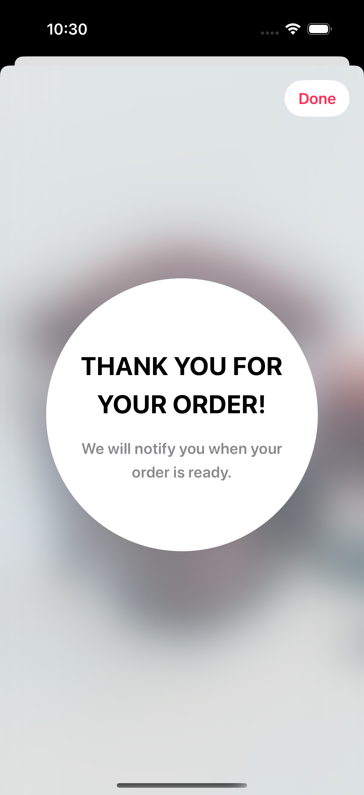
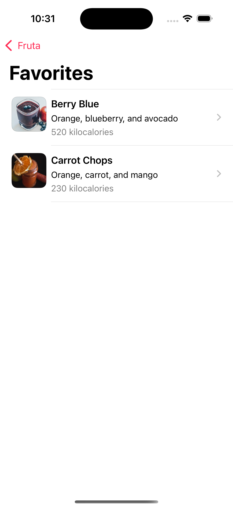

# AppClip

This App Clip was developed as a demo to showcase how a lightweight ios experience can provide quick access to essential app functionality without requiring a full app download. Built using Swift and Swiftui, the app focuses on a smooth, interactive UI for browsing food items and managing favourites.

# Key Features:

Quick launch experience under 10MB
Seamless user interface built with Swiftui
Supports instant actions like booking, scanning, or purchasing
Ideal for use cases like food ordering, ticketing, or product previews

# Home Screen
Features two primary actions: Menu and Favourites
Clean and responsive UI designed for instant engagement

# Menu
1. Displays a list of food items

  Tapping on an item reveals a detailed view:
  Ingredients list with clickable images
  Tapping on an ingredient shows its detailed description
  card back view displays nutritional information

A heart-shaped Like button at the top allows users to mark items as favourites

# Favorites
Displays all user-marked favourite items for quick access

## 📸 Screenshots

  
  
  
  
  

